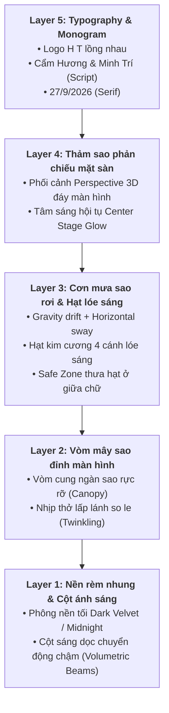

# 🌌 BÁO CÁO PHÂN TÍCH & BÓC TÁCH VIDEO SAO RƠI MÀN HÌNH LED TIỆC CƯỚI (AUDIT REPORT)

> **Dự án**: Video Sao Rơi 2K/4K Chiếu Màn Hình LED Hội Nghị & Tiệc Cưới  
> **File mẫu phân tích**: `1789659884390_6079974607183686661_6079974607183686661.mp4`  
> **Ngày lập báo cáo**: 18/09/2026  
> **Trạng thái**: Hoàn tất giai đoạn Audit & Bóc tách kỹ thuật (Phase 1)

---

## 1. TỔNG QUAN HỆ THỐNG & FILE CLIP GỐC

### 1.1. Thông số kỹ thuật file mẫu
| Hạng mục | Chi tiết thông số file mẫu | Nhận xét & Đánh giá |
| :--- | :--- | :--- |
| **Độ phân giải** | `1280 x 720 px` (Chuẩn HD 720p) | Khi phóng đại lên màn hình LED hội trường P2/P3 kích thước lớn (6m - 12m), các hạt sao và nét chữ bị vỡ rỗ, mờ nhòe và răng cưa rõ rệt. |
| **Tỉ lệ khung hình** | `16:9` (1.77:1) | Tỉ lệ tiêu chuẩn vàng cho các hệ thống màn hình LED sân khấu tiệc cưới hiện nay. |
| **Tốc độ khung hình** | `30.00 fps` | Ở một số khung hình hạt rơi mật độ cao, chuyển động mắt người nhìn thấy có độ trễ nhẹ, chưa đạt độ mượt mà cao cấp (cinematic smoothness). |
| **Định dạng & Codec** | Video H.264 (High Profile, Level 3.1), `yuv420p`, BT.709 | Tương thích rất tốt với các thiết bị giải mã phần cứng sân khấu. |
| **Bitrate Video** | `~2,025 kbps` | Mức nén tương đối cao, xuất hiện hiện tượng color banding (vệt bậc thang màu) ở các vùng gradient tối. |
| **Thời lượng & Vòng lặp** | `20.63 giây` (619 frames) | Video chưa phải là **Seamless Loop 100%** (ở frame 607–619 bị chuyển vùng trắng/kết thúc đột ngột), chưa thể chạy lặp vô tận tự nhiên trên sân khấu. |
| **Âm thanh** | Kênh im lặng (Silent AAC, 2 kbps) | Chuẩn cho background visual sân khấu (âm thanh thực tế do hệ thống mixer/DJ đám cưới phụ trách). |

---

## 2. BÓC TÁCH KIẾN TRÚC ĐỒ HỌA & VISUAL LAYERS

Video được xây dựng theo cấu trúc **5 lớp thị giác xếp chồng (Depth Stacking Layers)** tạo chiều sâu 3D sang trọng:

### 2.1. Chi tiết từng lớp thành phần

#### 🔹 Layer 1: Phông nền rèm nhung & Cột sáng sân khấu (Volumetric Stage Backdrop)
- **Bản chất**: Phông nền tối kết hợp chuyển động ánh sáng chậm.
- **Màu sắc**: Đen nhung sâu (`#050608`), than chì thẫm (`#0C0E14`) kết hợp sắc xanh băng rất nhẹ (`#101622`).
- **Chi tiết visual**:
  - Các nếp gấp rèm dọc mờ ảo (fabric pleats) tạo cảm giác sân khấu hội trường trang nghiêm, lãng mạn.
  - **Cột sáng rọi dọc (Volumetric Light Pillars / Light Shafts)**: 4–6 dải sáng mờ quét nhẹ nhàng từ sau ra trước, chuyển động với chu kỳ chậm (pulse 15–20s) giúp sân khấu luôn sống động, có chiều sâu không gian đa chiều.

#### 🔹 Layer 2: Vòm mây sao đỉnh màn hình (Top Stardust Canopy)
- **Vị trí**: Chiếm 20% – 28% chiều cao đỉnh màn hình.
- **Mật độ**: Rất dày đặc ở mép trên và thoai thoải mờ dần khi xuống gần vùng giữa.
- **Cơ chế hạt**:
  - Hàng nghìn hạt micro-star kích thước từ `2px` đến `6px`.
  - Phổ màu: Trắng kim cương (`#FFFFFF`), trắng bạc (`#E8F0FE`), phảng phất ánh xanh ngọc nhạt (`#D6E8FF`).
  - Mỗi hạt có một pha lệch nhấp nháy riêng (`phase offset`), dao động độ sáng theo hàm Sin để tạo cảm giác bầu trời đêm ngàn sao thở nhẹ.

#### 🔹 Layer 3: Cơn mưa sao rơi tự do & Hạt lóe sáng (Falling Stars & Diamond Sparkles)
- **Vị trí**: Rơi xuyên suốt từ đỉnh màn hình xuống chạm thảm sàn.
- **Vật lý chuyển động (Particle Physics)**:
  - **Trọng lực rơi chậm**: Vận tốc rơi được điều tiết êm ái (khoảng 35px – 80px/giây), tránh rơi nhanh gây cảm giác bão tuyết hay mưa dông.
  - **Lắc lư ngang (Horizontal Sway)**: Sử dụng dao động điều hòa `Math.sin(frame * freq + phase) * amplitude` mô phỏng lực cản không khí, làm hạt sao trôi lơ lửng bồng bềnh.
  - **Hạt điểm nhấn (Diamond Glints / 4-point Starbursts)**: Cứ mỗi 15–25 hạt tròn sẽ xuất hiện 1 ngôi sao 4 cánh phát quang chói lóa, nhấp nháy mạnh mẽ rồi dịu xuống.
  - **Vùng thở thị giác (Center Safe Zone)**: Tại khu vực tọa độ chữ (giữa màn hình), mật độ hạt được giảm 50% – 60% để đảm bảo tên Cô dâu – Chú rể luôn hiển thị rực rỡ và dễ đọc từ bàn tiệc xa nhất.

#### 🔹 Layer 4: Thảm kim tuyến phản chiếu mặt sàn (Floor Perspective Sparkle)
- **Vị trí**: Chiếm 30% – 35% chiều cao đáy màn hình.
- **Phối cảnh 3D (Depth Perspective)**:
  - Hạt ở xa (chân chữ) rất nhỏ, mật độ dày đặc tạo thành một dải sương mù phát quang (ambient mist glow).
  - Hạt ở gần (mép đáy màn hình) có kích thước lớn hơn (`6px` – `14px`), độ nét cao, có bóng đổ nhẹ.
- **Tâm sáng sân khấu (Center Stage Spotlight Glow)**: Một vầng sáng hình elip nằm bẹt ở đáy giữa, tạo bệ đỡ cho cả bố cục không bị chìm.

#### 🔹 Layer 5: Lớp định danh Trung tâm (Center Branding & Typography)
- **Logo Monogram (H T)**:
  - Vị trí: 1/3 trên trục tung trung tâm.
  - Phong cách: Thiết kế lồng ghép hai chữ cái đầu của Cô dâu & Chú rể (`H` & `T`), đường nét mảnh, thanh lịch, đường cong bo tròn tinh tế.
- **Tên Dâu & Rể ("Cẩm Hương & Minh Trí")**:
  - Vị trí: Chính giữa trung tâm thị giác.
  - Font chữ: Calligraphy / Luxury Wedding Script viết tay nghệ thuật, có các nét nối uốn lượn bay bổng.
- **Ngày cưới ("27/9/2026")**:
  - Vị trí: Ngay dưới tên Dâu Rể.
  - Font chữ: Cổ điển có chân (Serif) với độ giãn dòng (letter-spacing) thoáng đãng, tạo cảm giác trang trọng.
- **Xử lý ánh sáng chữ**:
  - Màu trắng nguyên bản (`#FFFFFF`).
  - Có lớp viền sáng phát quang mờ ảo (Soft Glow / Radial Drop Shadow: `0 0 20px rgba(255,255,255,0.8), 0 0 45px rgba(200,225,255,0.4)`), giúp chữ nổi khối hoàn toàn khỏi các hạt sao bay ngang qua.

---

## 3. ĐỐI SOÁT KINH NGHIỆM VỚI DỰ ÁN CŨ (`video-slide-damcuoi`)

Từ việc audit mã nguồn dự án trước của bạn tại `/Users/phamminhtri/Desktop/train/video-slide-damcuoi`, chúng ta rút ra được các giải pháp kỹ thuật cốt lõi có thể kế thừa và nâng cấp:

| Kỹ thuật từ dự án cũ | Đánh giá & Ứng dụng sang dự án Sao Rơi mới |
| :--- | :--- |
| **Cấu hình Remotion 2K/4K** | Kế thừa hoàn toàn cấu hình tại `remotion.config.ts` (CRF 18, H.264, yuv420p, `--gl=angle` trên macOS) để video đạt độ nét tuyệt đối khi chiếu màn LED. |
| **Tối ưu GPU & Loại bỏ Backdrop-filter** | Tuyệt đối **không dùng CSS `backdrop-filter`** (đã từng gây sọc vỡ ở dự án trước), thay thế bằng các lớp `radial-gradient` xếp tầng và GPU Transform (`translate3d`). |
| **Thuật toán hạt vòng lặp (`GoldenDust.tsx`)** | Kế thừa thuật toán vòng lặp modulo toán học `((baseY + frame * speed) % totalHeight)` để hạt sao rơi liên tục không bao giờ bị đứt đoạn. |
| **Sao 4 cánh phát sáng (`GoldenStardust.tsx`)** | Tái sử dụng cấu trúc SVG tia chéo + tâm sáng kim cương để làm hạt sao nổ lấp lánh (sparkle starbursts). |
| **Quản lý biến cấu hình tập trung (`weddingConfig.ts`)** | Xây dựng file `starConfig.ts` cho phép người dùng đổi tên Dâu Rể, ngày cưới, thay file logo SVG, chỉnh tốc độ rơi, mật độ hạt chỉ trong 5 giây. |

---

## 4. BẢNG MỤC TIÊU NÂNG CẤP LÊN CHUẨN 2K / 4K CHO DỰ ÁN MỚI

| Tiêu chí kỹ thuật | File mẫu hiện tại (720p) | Bản dựng mới mục tiêu (2K / 4K) |
| :--- | :--- | :--- |
| **Độ phân giải** | `1280 x 720` (HD) | **2K**: `2560 x 1440 px`   **4K**: `3840 x 2160 px` |
| **Tốc độ khung hình (FPS)** | `30 fps` | **60 fps siêu mượt** (Mỗi hạt sao rơi chuyển động êm như nhung) |
| **Tính chất vòng lặp (Looping)**| Gián đoạn ở đuôi | **Seamless Loop 100%**: Frame cuối = Frame đầu, màn LED có thể phát lặp 24/7 không một gợn giật |
| **Độ sắc nét hạt (Fidelity)** | Hạt bị bệt pixel khi chiếu lớn | Hạt tròn và tia sao vẽ bằng vector/SVG toán học, sắc nét từng hạt bụi |
| **Tùy biến nhận diện (Customization)** | Cố định, không chỉnh sửa được | Cho phép tùy biến: Tên, Ngày, File Logo Monogram bất kỳ |
| **Bảng màu hỗ trợ (Themes)** | Chỉ có Trắng Bạc cố định | Hỗ trợ 3 Theme màu tiệc cưới kinh điển:  1. **Diamond Silver** (Trắng Bạc - Sang trọng, Tinh khôi)  2. **Champagne Gold** (Vàng Ánh Kim - Quý phái, Ấm áp)  3. **Midnight Sapphire** (Xanh Lam Hoàng Gia - Huyền ảo, Cổ tích) |

---

## 5. ĐÁNH GIÁ THỰC NGHIỆM REMOTION & LỘ TRÌNH NGHIỆM THU TỪNG PHÂN VÙNG

Sau khi kiểm thử thực tế bản sườn Scaffold trên Remotion Studio, khoảng cách lớn nhất so với video gốc nằm ở **mật độ và hiệu ứng cộng sáng của hạt sao**. Thẻ HTML `
` không đủ khả năng tái tạo hàng ngàn hạt bụi kim cương phát quang như Trapcode Particular trong clip mẫu.

Chi tiết bản phân tích đối chiếu từng pixel và giải pháp kỹ thuật đã được tổng hợp riêng tại:
👉 [**`docs/audit-so-sanh-va-giai-phap.md`**](file:///Users/phamminhtri/Desktop/project/wedding/project-video-sao-roi/docs/audit-so-sanh-va-giai-phap.md)

### Thứ tự ưu tiên thực thi & nghiệm thu cuốn chiếu:
1. **Giai đoạn 1 (Ưu tiên hàng đầu)**: Nâng cấp **Top Layer (Star Canopy)** và **Bottom Layer (Stage Floor)** sang Engine Canvas 2D với hiệu ứng Additive Blending (`lighter`). Kiểm thử và nghiệm thu.
2. **Giai đoạn 2**: Tinh chỉnh **Falling Stars (Mưa sao rơi)** thanh mảnh, bồng bềnh.
3. **Giai đoạn 3**: Vẽ lại chuẩn xác 100% **Logo Monogram H T** (SVG vector nghệ thuật), chuẩn hóa font chữ Dâu Rể và định dạng ngày cưới `27/9/2026`.
4. **Giai đoạn 4**: Tinh chỉnh **Phông rèm nhung & Cột sáng rọi sân khấu (Volumetric God Rays)**. Nghiệm thu toàn diện.
