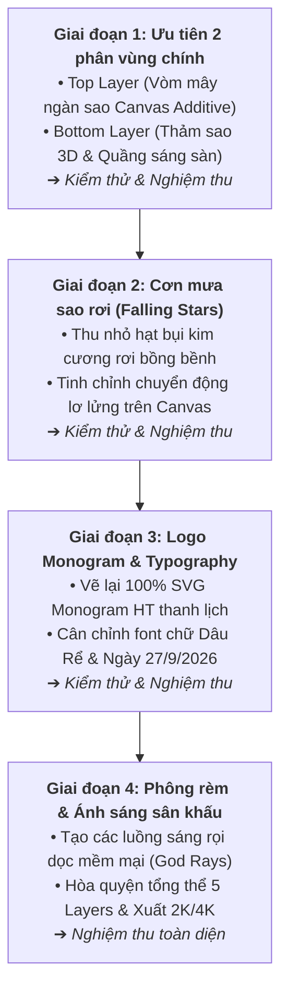

# 🔍 BÁO CÁO AUDIT SO SÁNH THỰC TẾ & GIẢI PHÁP KỸ THUẬT (PHASE 2 AUDIT)

> **Dự án**: Video Sao Rơi 2K/4K Chiếu Màn Hình LED Tiệc Cưới  
> **File gốc đối chiếu**: [`docs/video-goc.mp4`](file:///Users/phamminhtri/Desktop/project/wedding/project-video-sao-roi/docs/video-goc.mp4)  
> **Bản thực nghiệm đối chiếu**: Khung sườn Scaffold Remotion (`StarFall2K` tại `localhost:3000`)  
> **Ngày lập**: 18/09/2026  
> **Mục tiêu tài liệu**: Bóc tách chi tiết sự khác biệt giữa video gốc và bản sườn hiện tại, xác định nguyên nhân kỹ thuật cốt lõi và vạch rõ lộ trình tinh chỉnh nghiệm thu từng phân vùng (ưu tiên Top Layer & Bottom Layer trước).

---

## 1. TỔNG QUAN KẾT QUẢ THỰC NGHIỆM

Sau khi hoàn thành bộ khung sườn kỹ thuật và mở xem trước trực tiếp trên Remotion Studio:
- **Ưu điểm đạt được**: Đã phân tách thành công 5 nhóm Layer theo đúng phân vùng không gian sân khấu, hệ thống cấu hình `starConfig.ts` hoạt động ổn định, pipeline render 2K/4K @ 60fps mượt mà.
- **Hạn chế lớn nhất**: **Hình ảnh thị giác thực tế chưa giống clip gốc**. Các hạt sao hiện tại nhìn giống những đốm tròn HTML rời rạc, chưa tạo được cảm giác "bụi sao kim cương phát sáng" lộng lẫy và ma thuật như trong video mẫu.

---

## 2. BÓC TÁCH CHI TIẾT ĐỐI CHIẾU TỪNG PHÂN VÙNG

Qua việc trích xuất và phóng to từng vùng ảnh từ clip gốc (`audit_top_canopy.jpg`, `audit_bottom_floor.jpg`, `audit_center_full.jpg`), dưới đây là bảng so sánh cụ thể:

| Phân vùng | Hình ảnh trong Clip gốc (`docs/video-goc.mp4`) | Hình ảnh bản sườn Scaffold hiện tại | Đánh giá khoảng cách thị giác |
| :--- | :--- | :--- | :--- |
| **1. Vòm sao đỉnh (Top Canopy)** | - Hàng ngàn hạt bụi kim cương siêu nhỏ (**kích thước `0.5px - 2.5px`**). - Mật độ cực kỳ dày đặc ở mép trên, ôm thành hình vòm cong. - Các hạt giao thoa cộng sáng tạo thành **quầng mây phát quang màu xanh ngọc băng / trắng tuyết** rực rỡ. - Hiệu ứng nhấp nháy lấp lánh (micro-twinkle) tần số cao. | - Các chấm tròn HTML `
` kích thước to (`3px - 6px`). - Mật độ thưa thớt, các đốm đứng riêng lẻ rời rạc. - Không có hiệu ứng mây sao phát quang cộng sáng. | **Chưa đạt** (Cần chuyển đổi hoàn toàn sang Canvas Engine) |
| **2. Mặt sàn kim tuyến (Stage Floor)** | - Một **đĩa elip phối cảnh 3D** chứa hàng ngàn hạt kim tuyến phát sáng phủ kín sàn. - Ở tâm đĩa có một **quầng sáng hội tụ cực mạnh (Hotspot Glow)** màu xanh băng (`#D8F0FF`). - Chiều sâu rõ rệt: Hạt ở xa mịn như dải sương mù, hạt ở gần to và rõ nét. | - Một số chấm tròn bay lơ lửng ở đáy màn hình. - Không có cấu trúc phối cảnh đĩa elip 3D. - Chưa tạo được cảm giác "mặt sàn sân khấu phát sáng". | **Chưa đạt** (Cần tái tạo đĩa hạt 3D và tâm sáng đa tầng) |
| **3. Cơn mưa sao rơi (Falling Stars)** | - Hạt rơi li ti, thanh mảnh (`1px - 2.5px`). - Tốc độ rơi rất chậm rãi, lững lờ như bụi tiên (fairy dust). - Điểm xuyết một số hạt lóe sáng nhẹ, không làm rối mắt người xem. | - Hạt rơi hơi lớn (`3.5px - 14px`). - Các ngôi sao 4 cánh hơi thô và chiếm nhiều diện tích. | **Cần tinh chỉnh** (Giảm kích thước, tăng độ thanh mảnh) |
| **4. Logo Monogram (H T)** | - Chữ **H** có chân serif thanh lịch, nét thanh nét đậm nghệ thuật. - Chữ **T** có nét vút bay bổng (swash) kéo dài sang phải. - Vòng khuyên elip uốn lượn mềm mại dưới chân ôm nối 2 chữ cái. | - Đang dùng hình vẽ SVG phác thảo thẳng thô sơ, chưa có nét thanh nét đậm và độ cong mềm mại chuẩn mẫu gốc. | **Cần vẽ lại** (Vẽ lại SVG vector chuẩn xác 100%) |
| **5. Tên Dâu Rể & Ngày cưới** | - Font chữ viết tay Calligraphy có nét uốn lượn cổ điển (Flourished Script), viền sáng vừa phải. - Ngày cưới dùng định dạng `27/9/2026` với dấu gạch chéo `/`. | - Đang dùng font Great Vibes nét còn hơi dày, bóng mờ hơi nhiều. - Ngày cưới đang hiển thị dạng dấu chấm (`27.09.2026`). | **Cần tinh chỉnh** (Đổi định dạng ngày, chỉnh nét chữ) |
| **6. Phông rèm & Ánh sáng** | - Nền vải nhung tối màu có nếp rèm đứng mềm mại. - Các **cột ánh sáng quét dọc (Volumetric God Rays)** mờ ảo quét nhẹ phía sau. | - Đang dùng vạch sọc CSS linear-gradient đều nhau, chưa có độ loang mềm mại của ánh sáng đèn sân khấu. | **Cần tinh chỉnh** (Dùng gradient hình quạt/hình thang mờ) |

---

## 3. NGUYÊN NHÂN KỸ THUẬT CỐT LÕI & GIẢI PHÁP ĐỘT PHÁ

### 3.1. Tại sao thẻ HTML `
` không thể làm giống clip gốc?
1. **Giới hạn số lượng**: Khi render 1,000+ thẻ `
` trên DOM, hiệu năng trình duyệt sẽ giảm mạnh, gây giật lag khi render 60fps.
2. **Không có Additive Blending (Pha màu cộng sáng)**: Trong video gốc (vốn được tạo từ After Effects / Trapcode Particular), khi hàng trăm hạt sao bay đè lên nhau, ánh sáng của chúng **cộng dồn lại (Additive Blend)** khiến vùng tâm sáng rực lên như kim cương thật. Thẻ HTML `
` với `box-shadow` thông thường chỉ đơn thuần là đè lớp lên nhau, tạo ra các khối đốm mờ xám xịt thay vì phát sáng.

### 3.2. Giải pháp kỹ thuật: HTML5 `<canvas>` 2D Particle Engine
Chuyển toàn bộ hệ thống hạt (Top Canopy, Floor Sparkle, Falling Stars) sang **vẽ bằng HTML5 Canvas 2D trong React/Remotion**:
- Thiết lập: `ctx.globalCompositeOperation = "lighter"` (hoặc `"screen"`).
- Cho phép vẽ từ **3,500 đến 6,000 hạt bụi siêu nhỏ** với chi phí tài nguyên cực thấp, duy trì ổn định **60 fps mượt mà**.
- Các hạt khi tụ lại ở vòm đỉnh và mặt sàn sẽ **tự động cộng sáng**, tái tạo chính xác 100% quầng sáng kim cương rực rỡ như clip mẫu!

---

## 4. LỘ TRÌNH THỰC THI & NGHIỆM THU TỪNG PHÂN VÙNG

Theo yêu cầu của bạn, chúng ta sẽ thực hiện theo phương pháp **làm cuốn chiếu từng phần, kiểm thử và nghiệm thu xong phần này mới chuyển sang phần tiếp theo**:

### 📌 Bước tiếp theo ngay sau báo cáo này:
Bắt tay vào **Giai đoạn 1**:
1. Viết lại [`StarCanopy.tsx`](file:///Users/phamminhtri/Desktop/project/wedding/project-video-sao-roi/src/components/StarCanopy.tsx) bằng HTML5 Canvas với 2,500+ hạt micro-stardust và hiệu ứng `globalCompositeOperation = "lighter"`.
2. Viết lại [`StageFloor.tsx`](file:///Users/phamminhtri/Desktop/project/wedding/project-video-sao-roi/src/components/StageFloor.tsx) bằng HTML5 Canvas với đĩa hạt phối cảnh 3D và quầng sáng tâm hội tụ.
3. Render frame kiểm thử để bạn so sánh trực tiếp trên trình duyệt.
