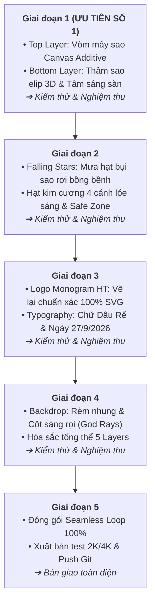

# 📋 KẾ HOẠCH TỔNG QUÁT: NÂNG CẤP & HOÀN THIỆN VIDEO SAO RƠI 2K/4K

> **Mục tiêu**: Nâng cấp chất lượng visual của dự án từ khung sườn cơ bản đạt độ tinh xảo, chân thực và lộng lẫy tương đương clip mẫu [`docs/video-goc.mp4`](file:///Users/phamminhtri/Desktop/project/wedding/project-video-sao-roi/docs/video-goc.mp4).  
> **Phương pháp làm việc**: **Cuốn chiếu từng phân vùng (Module-by-Module)**. Triển khai ➔ Kiểm thử trực tiếp trên Remotion Studio (`localhost:3000`) ➔ Người dùng nghiệm thu ➔ Chuyển sang phân vùng tiếp theo.

---

## 🗺️ LỘ TRÌNH TRIỂN KHAI 5 GIAI ĐOẠN

---

## 🎯 CHI TIẾT TỪNG GIAI ĐOẠN

### 💎 GIAI ĐOẠN 1: HAI PHÂN VÙNG CỐT LÕI (TOP CANOPY & STAGE FLOOR)
> **Mục tiêu**: Tái tạo không gian phát sáng của vòm ngàn sao đỉnh và thảm kim tuyến đáy sàn. Đây là 2 vùng chiếm 60% diện tích và tạo nên linh hồn lấp lánh của video.

#### 1.1. Top Star Canopy (Vòm mây sao đỉnh) – `src/components/StarCanopy.tsx`
- **Công nghệ**: Chuyển từ thẻ HTML `
` sang **HTML5 `<canvas>` 2D**.
- **Mật độ & Kích thước**:
  - Tạo **2,500 – 4,000 hạt micro-stardust** siêu nhỏ (`0.6px - 2.2px`).
  - Phân bố tập trung hình vòm cung: dày đặc ở sát mép trên cùng và hai góc trên, thoai thoải mở rộng ở giữa.
- **Hiệu ứng cộng sáng (Additive Blending)**:
  - Sử dụng `ctx.globalCompositeOperation = "lighter"` (hoặc `"screen"`).
  - Khi hàng ngàn hạt li ti chồng lên nhau, chúng tự động tạo nên **quầng mây sáng phát quang màu xanh ngọc băng / trắng tuyết (`#D8F0FF`)** rực rỡ như dải ngân hà.
- **Chuyển động lấp lánh (Shimmer / Micro-twinkle)**:
  - Mỗi hạt có tần số dao động Sin riêng theo chu kỳ `loopDurationFrames`, đảm bảo 100% Seamless Loop.

#### 1.2. Stage Floor (Thảm sao phản chiếu mặt sàn & Tâm sáng) – `src/components/StageFloor.tsx`
- **Công nghệ**: Chuyển sang **HTML5 `<canvas>` 2D với Additive Blending**.
- **Cấu trúc Đĩa hạt elip 3D**:
  - Tạo **2,000 – 3,500 hạt kim tuyến** phân bổ theo hình đĩa elip nằm bẹt phối cảnh 3D (góc nghiêng ~75°).
  - Chiều sâu rõ rệt: Hạt ở xa mịn như sương mờ phát quang, hạt ở gần to rõ nét (`3px - 8px`).
- **Tâm sáng hội tụ đa tầng (Center Spotlight Puddle)**:
  - Thiết kế quầng sáng elip phát quang cực mạnh ở trung tâm mặt sàn (`#D4EFFF` và `#EAF6FF`), tạo bệ đỡ ánh sáng vững chãi cho toàn bộ sân khấu tiệc cưới.

> 🔍 **Tiêu chí nghiệm thu Giai đoạn 1**:
> - Vòm đỉnh hiển thị như một biển sao kim cương dày đặc, phát sáng rực rỡ chứ không phải các đốm rời rạc.
> - Mặt sàn có chiều sâu phối cảnh 3D rõ rệt, tâm sáng hội tụ nổi bật.
> - Tốc độ khung hình duy trì mượt mà **60 fps** trên Remotion Studio.

---

### ✨ GIAI ĐOẠN 2: CƠN MƯA SAO RƠI (FALLING STARS CASCADE)
> **Mục tiêu**: Tái tạo các hạt sao rơi thanh thoát lơ lửng, tạo nhịp điệu chuyển động êm ái giữa vòm trên và mặt sàn.

- **Thành phần**: `src/components/FallingStars.tsx`
- **Nâng cấp**:
  - Thu nhỏ kích thước hạt từ `3.5px - 14px` xuống `1px - 3px` để đạt độ thanh mảnh, sang trọng như bụi tiên (fairy dust).
  - Tích hợp các ngôi sao 4 cánh lóe sáng (Diamond cross glints) xoay tròn và nhấp nháy êm ái.
  - Tinh chỉnh lực cản không khí (Horizontal sway) chậm rãi, tránh cảm giác mưa dông/bão tuyết.
  - Hoàn thiện vùng an toàn (Safe Visual Zone) để giữ cho tên Dâu Rể luôn rõ ràng, dễ đọc.

> 🔍 **Tiêu chí nghiệm thu Giai đoạn 2**:
> - Hạt sao rơi thanh thoát, không che khuất chữ, tạo cảm giác lãng mạn và bay bổng.

---

### ✒️ GIAI ĐOẠN 3: LOGO MONOGRAM & TYPOGRAPHY
> **Mục tiêu**: Tái tạo chuẩn xác nhận diện thương hiệu lễ cưới sắc nét từng đường nét.

- **Thành phần**: `src/components/CenterTypography.tsx`
- **Nâng cấp**:
  - **Logo Monogram HT**: Vẽ lại chuẩn xác 100% bằng SVG vector:
    - Chữ `H` với hai thân đứng có chân serif cổ điển, nét thanh nét đậm.
    - Chữ `T` bên phải với nét ngang kéo dài thành nét vút bay bổng (swash) sang phải.
    - Vòng khuyên elip uốn lượn mềm mại dưới chân kết nối 2 chữ cái.
  - **Tên Dâu Rể**: Tinh chỉnh font chữ thư pháp viết tay thanh mảnh, sắc nét, giảm bớt độ nhòe của bóng mờ (`text-shadow`) để chữ luôn tinh khôi.
  - **Ngày cưới**: Cập nhật chuẩn định dạng `27/9/2026` với dấu gạch chéo `/` và font chữ có chân cổ điển.

> 🔍 **Tiêu chí nghiệm thu Giai đoạn 3**:
> - Logo và chữ sắc lẹm ở chuẩn 2K/4K, phong cách đúng chuẩn lễ cưới quý phái như clip gốc.

---

### 🏛️ GIAI ĐOẠN 4: PHÔNG RÈM & CỘT ÁNH SÁNG SÂN KHẤU (STAGE BACKDROP)
> **Mục tiêu**: Tạo chiều sâu không gian hội trường sang trọng phía sau.

- **Thành phần**: `src/components/StageBackdrop.tsx`
- **Nâng cấp**:
  - Thay thế các vạch sọc CSS bằng phông rèm nhung tối mềm mại với các nếp gấp đứng tự nhiên.
  - Dựng các **cột ánh sáng quét dọc (Volumetric God Rays)** hình quạt tỏa từ trên đỉnh xuống mờ ảo, chuyển động chậm rãi tạo cảm giác như có đèn follow sân khấu thực tế rọi vào.

> 🔍 **Tiêu chí nghiệm thu Giai đoạn 4**:
> - Sân khấu có chiều sâu đa chiều, không bị tối tăm hay phẳng lì.

---

### 🚀 GIAI ĐOẠN 5: TỐI ƯU SEAMLESS LOOP, RENDER & ĐỒNG BỘ GITHUB
> **Mục tiêu**: Hoàn thiện sản phẩm cuối cùng và bàn giao.

- Kiểm tra tính toán vòng lặp tuần hoàn 100% Seamless Loop (frame 1200 nối mượt mà về frame 0).
- Kiểm tra các theme màu trong `starConfig.ts` (`silverDiamond`, `champagneGold`, `midnightSapphire`, `roseGold`).
- Chạy lệnh xuất video 2K MP4 (`npm run render:2k`) và kiểm tra chất lượng file xuất ra.
- Commit toàn bộ tài liệu và mã nguồn lên GitHub.

---

## 📌 QUY TRÌNH BẮT ĐẦU GIAI ĐOẠN 1
Sau khi bạn duyệt kế hoạch tổng quát này:
1. Bắt tay vào **Giai đoạn 1**: Cải tổ `StarCanopy.tsx` và `StageFloor.tsx` sang HTML5 Canvas Additive Blending.
2. Bạn mở xem trực tiếp trên browser `http://localhost:3000` (Remotion Studio đang chạy).
3. Đánh giá và chỉnh sửa cho tới khi bạn ưng ý 100% Giai đoạn 1 rồi mới bước sang Giai đoạn 2.
